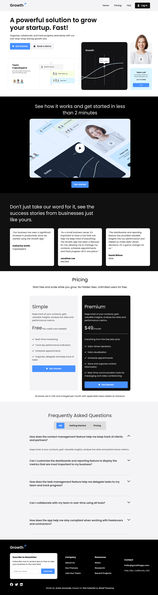

# Landing page de solución de software

Sitio creado en HTML, CSS y JS puros (sin frameworks ni librerías), que representa una página de presentación de un software como servicio (SaaS).
Únicamente utilicé algo de JavaScript para el menú en vista móvil y las preguntas frecuentes.

Este sitio fue construido en base a un [tutorial de YouTube](https://www.youtube.com/watch?v=HXYZxVbWkjc), de [Brad Traversy](https://github.com/bradtraversy).
Originalmente, el proyecto es un desafío del sitio de [iCodeThis](https://icodethis.com/?ref=traversy).

## Vista previa del sitio

